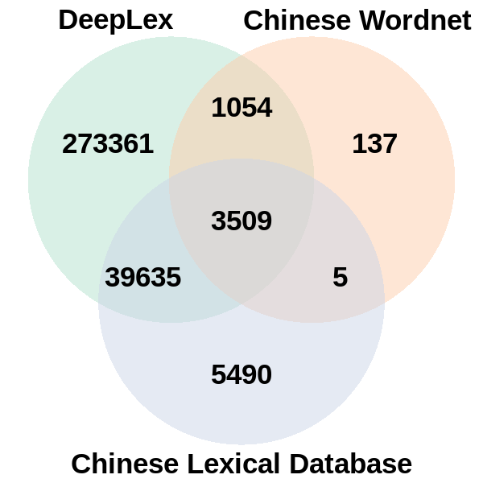

```{r, include = FALSE}
knitr::opts_chunk$set(
  collapse = TRUE,
  comment = "#>"
)
```


`lexicoR` contains two lexical databases, [DeepLex](http://dx.doi.org/10.6129%2fCJP.201909_61(3).0004) and [Chinese Lexical Database](http://www.chineselexicaldatabase.com). See [the bottom of the page](#references) for Chinese Lexical Database's original paper. All rights of the Chinese Lexical Database belong to the original authors.


## Usage

```{r}
library(lexicoR)
```

The function, `query.lu()`, can be used to query lexical entries in these databases.

```{r warning=FALSE, message=FALSE}
query.lu("我", regex = TRUE, isSimp = FALSE)
```


By default, `query.lu()` queries both databases. If you only want results from a particular database, you can provide an additional argument `db`:

```{r}
query.lu("我", regex = TRUE, db = "deeplex")
```


When calling `query.lu()` for the first time, the databases (`deeplex` & `cld`) would be loaded into the global environment. These databases are stored as regular data frames. You can access it directly:

```{r}
str(cld)
```

```{r}
str(deeplex)
```


## Lexical databases  in `lexicoR`

The two databases, `deeplex` & `cld`, were preprocessed and left-joined together respectively, before being bundled to the package. Hence, they have identical variables, with the source database's name (`cld.`, `cwn.`, or  `dl.`) prepended to the variables' names.

The variable `cwn.n_sense` records the number of senses of a lemma that can be found in [Chinese Wordnet](http://lope.linguistics.ntu.edu.tw/cwn2). There are only about 4,500 lemmas in Chinese Wordnet, which is few compared to DeepLex and Chinese Lexical Database, hence many entries in `cwn.n_sense` are `NA`. The venn diagram below shows the number of overlapping and distinct lexical entries found in the three lexical databases.

{.half}


## References

Sun, C. C., Hendrix, P., Ma, J.Q. & Baayen, R. H. (2018). Chinese Lexical Database (CLD): A large-scale lexical database for simplified Mandarin Chinese. *Behavior Research Methods*, https://doi.org/10.3758/s13428-018-1038-3.
