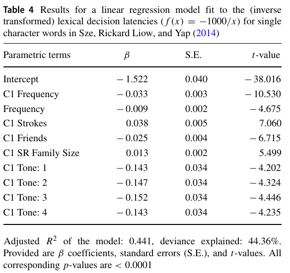

```{r, include = FALSE}
knitr::opts_chunk$set(
  collapse = TRUE,
  comment = "#>"
)
```

Download the source (data + Rmd) [here](https://lopentu.github.io/lexicoR-data/model_fitting.zip).

```{r}
LDT = readRDS("lexical_decision_latencies.rds")
tibble::as_tibble(LDT)
```

## Reproduce CLD paper

The code below tried to reproduce the results of fitting a linear regression model to the lexical decision latencies for single character words in Table 4 in Sun et al. (2018):

{style="width:50%; display:block; margin: 0 auto; padding: 0 auto"}

```{r}
model_glm = glm(-1000/RT ~ log(cld.C1Frequency) + log(cld.Frequency) + sqrt(cld.C1Strokes), data = LDT)
summary(model_glm)
```

## Adding PTT freqency data

### Data: 2004-2019

```{r}
model_glm = glm(-1000/RT ~ log(pttFreq.all) + log(cld.C1Frequency) + log(cld.Frequency) + sqrt(cld.C1Strokes), data = LDT[LDT$pttFreq.all > 0,])
summary(model_glm)
```

### Data: 2004-2009, 2010-2014, 2015-2019

```{r}
model_glm = glm(-1000/RT ~ log(pttFreq.2004_2009) + log(pttFreq.2010_2014) + log(pttFreq.2015_2019) + log(cld.C1Frequency) + log(cld.Frequency) + sqrt(cld.C1Strokes), 
                data = dplyr::filter(LDT, 
                                     pttFreq.2004_2009 > 0, 
                                     pttFreq.2010_2014 > 0, 
                                     pttFreq.2015_2019 > 0))
summary(model_glm)
```

## Adding Traditional Chinese strokes information

```{r}
model_glm = glm(-1000/RT ~ log(cld.C1Frequency) + log(cld.Frequency) + sqrt(trad_strokes), data = LDT)
summary(model_glm)
```

```{r}
model_glm = glm(-1000/RT ~ log(cld.C1Frequency) + log(cld.Frequency) + sqrt(cld.C1Strokes) + sqrt(trad_strokes), data = LDT)
summary(model_glm)
```


